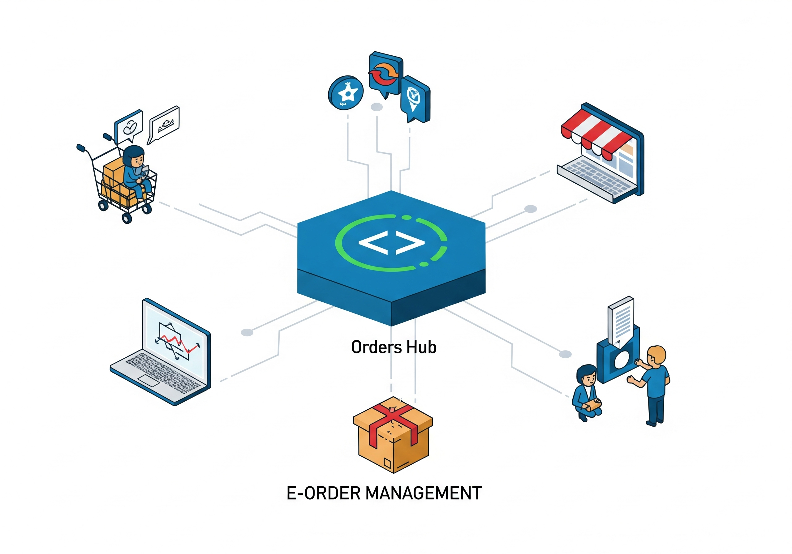
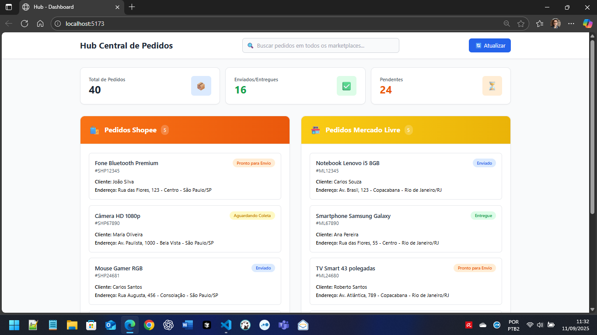
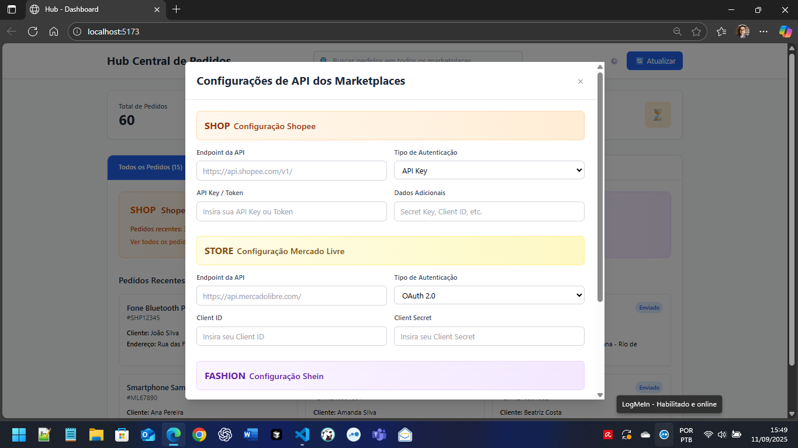

# Hub Central de Pedidos



Sistema integrado para centralização e gestão de pedidos de múltiplos marketplaces em uma interface unificada com documentação interativa Swagger UI.

## Visão Geral

O Hub Central de Pedidos é uma solução tecnológica avançada desenvolvida para empresas que vendem em múltiplas plataformas de e-commerce. O sistema centraliza todos os pedidos do **Shopee**, **Mercado Livre** e **Shein** em uma única interface, permitindo gestão eficiente e controle completo das operações com arquitetura modular e API documentada.

## Valor de Negócio

**Eficiência Operacional**: Reduza o tempo gasto alternando entre diferentes plataformas de marketplace, consolidando todas as informações em um só lugar.

**Visibilidade Completa**: Tenha uma visão panorâmica de todos os pedidos, independente da origem, com estatísticas em tempo real.

**Busca Avançada**: Localize rapidamente qualquer pedido utilizando código, nome do cliente, produto ou endereço de entrega.

**Gestão Centralizada**: Monitore status de entregas, identifique gargalos operacionais e otimize processos de fulfillment.

## Funcionalidades Principais



### Centralização de Pedidos
- Visualização unificada de pedidos do **Shopee**, **Mercado Livre** e **Shein**
- Interface única para gerenciamento de múltiplos canais de venda
- Sincronização automática de dados entre plataformas
- **60 pedidos totais** distribuídos entre os três marketplaces

### Sistema de Busca Inteligente
- Busca instantânea por código do pedido, nome do cliente, produto ou endereço
- Filtros avançados para localização rápida de informações
- Resultados em tempo real com paginação eficiente

### Dashboard Executivo
- Métricas consolidadas de vendas e entregas
- Indicadores de performance por marketplace
- Estatísticas de pedidos pendentes, enviados e entregues

### Gestão de Status
- Acompanhamento visual do status de cada pedido
- Identificação de pedidos que requerem ação imediata
- Controle de prazos de envio e entrega

### Interface com Abas Organizadas
- **Navegação por abas** para melhor organização
- **Aba "Todos os Pedidos"**: Visão consolidada com resumos de cada marketplace
- **Abas específicas**: Shopee, Mercado Livre e Shein com pedidos dedicados
- **Contadores dinâmicos** mostrando quantidade de pedidos por aba
- **Design responsivo** que se adapta a diferentes tamanhos de tela

### Configuração Avançada de APIs



O sistema inclui uma interface completa para configuração de endpoints e autenticação dos marketplaces:

- **Configuração por Marketplace**: Campos específicos para cada plataforma
  - **Shopee**: API Key, endpoint personalizado, tipos de autenticação
  - **Mercado Livre**: OAuth 2.0, Client ID/Secret, configurações específicas
  - **Shein**: API Key, Merchant ID, endpoint personalizado

- **Tipos de Autenticação Suportados**:
  - API Key para autenticação simples
  - OAuth 2.0 para integrações seguras
  - JWT Token para sistemas modernos
  - Basic Auth para compatibilidade legacy

- **Interface Intuitiva**:
  - Modal de configuração acessível via ícone de engrenagem ⚙️
  - Formulários organizados por marketplace com cores temáticas
  - Campos mascarados para credenciais sensíveis
  - Validação e feedback visual para cada configuração

- **Flexibilidade de Configuração**:
  - URLs de endpoint personalizáveis
  - Credenciais específicas por marketplace
  - Campos adicionais conforme necessário (Secret Keys, Merchant IDs)
  - Salvamento seguro das configurações

## Início Rápido

### Requisitos do Sistema
- Windows 10/11
- Node.js 18+ instalado
- Conexão com internet

### Instalação e Execução
```powershell
# Clone o repositório
git clone https://github.com/chmulato/hub_town.git
cd hub_town

# Execute o script de inicialização automática
.\start.ps1
```

O script automatizado irá:
1. Instalar todas as dependências necessárias
2. Configurar o ambiente de desenvolvimento
3. Inicializar o sistema back-end e front-end
4. Abrir a aplicação no navegador

### Acesso ao Sistema
- **Interface Principal**: http://localhost:5173
- **API de Dados**: http://localhost:3001
- **Documentação Interativa**: http://localhost:3001/api/swagger
- **Informações da API**: http://localhost:3001/api/info

## Dados e Integração

### Fonte de Dados
O sistema atualmente utiliza dados de demonstração que simulam pedidos reais:
- **20 pedidos Shopee** com produtos e status variados
- **20 pedidos Mercado Livre** com informações completas  
- **20 pedidos Shein** com produtos de moda internacional
- **Total: 60 pedidos** com dados brasileiros realistas incluindo endereços e produtos locais

### Capacidades da API
- **Endpoints REST** para integração com sistemas existentes
- **Documentação Swagger UI** interativa e completa
- **Autenticação JWT** configurável (habilitada/desabilitada)
- **Suporte a paginação** para grandes volumes de dados
- **Filtros parametrizáveis** para consultas específicas
- **Arquitetura modular** com middleware, rotas e serviços separados
- **Formato JSON padronizado** para intercâmbio de dados

## Arquitetura Técnica

### Tecnologias Utilizadas
- **Frontend**: React 18 com Vite para interface moderna e responsiva
- **Backend**: Node.js com Express.js em arquitetura modular
- **Documentação**: Swagger UI com swagger-jsdoc para API interativa
- **Autenticação**: JWT (JSON Web Tokens) configurável
- **Dados**: Arquivos JSON estruturados (preparado para migração para banco de dados)
- **Interface**: Tailwind CSS para design profissional e consistente
- **Middleware**: CORS, logging e tratamento de erros centralizado

## Status dos Pedidos

O sistema classifica e exibe os pedidos com status codificados por cores:

```
| Status                | Descrição                          | Ação Requerida          |
|-----------------------|------------------------------------|-------------------------|
| **Entregue**          | Pedido finalizado com sucesso      | Nenhuma                 |
| **Enviado**           | Pedido em trânsito para o cliente  | Acompanhar rastreamento |
| **Pronto para Envio** | Pedido preparado aguardando coleta | Agendar envio           |
| **Aguardando Coleta** | Pedido pendente de separação       | Processar pedido        |
```

## Roadmap de Desenvolvimento

### Versão Atual (2.0)
- **Centralização de pedidos** Shopee, Mercado Livre e Shein
- **Interface com abas organizadas** para melhor navegação
- **Configuração avançada de APIs** para todos os marketplaces
- **Sistema de busca unificada** com 60 pedidos totais
- **Swagger UI completo** com documentação interativa
- **Arquitetura modular** com config/, middleware/, routes/, services/
- **Autenticação JWT** configurável
- **Interface profissional** sem ícones infantilizados
- **Dashboard com métricas** básicas e avançadas

### Próximas Versões
- **Integração em Tempo Real**: Conexão direta com APIs dos marketplaces
- **Relatórios Avançados**: Análises de vendas e performance
- **Notificações**: Alertas automáticos para ações necessárias
- **Gestão de Estoque**: Controle integrado de inventário
- **Mobile App**: Aplicação nativa para gestão móvel

## Documentação Técnica

Para desenvolvedores e administradores de sistema, consulte a documentação técnica completa:

- **[Guia de Instalação](doc/INSTALACAO.md)**: Configuração detalhada do ambiente
- **[Documentação da API](doc/API.md)**: Referência completa dos endpoints
- **[Setup da API v2.0](doc/API_V2_SETUP.md)**: Configuração da nova arquitetura
- **[Guia do Swagger](doc/SWAGGER_GUIDE.md)**: Documentação interativa da API
- **[Arquitetura](doc/ARQUITETURA.md)**: Visão técnica do sistema
- **[Guia do Desenvolvedor](doc/DESENVOLVIMENTO.md)**: Informações para contribuidores

## Suporte e Contato

### Suporte Técnico
Para questões relacionadas à instalação, configuração ou uso do sistema:
- Consulte a documentação técnica na pasta `doc/`
- Abra uma issue no repositório GitHub
- Entre em contato com a equipe de desenvolvimento

### Proposta Comercial
Para discussões sobre implementação em ambiente corporativo ou customizações específicas:
- Entre em contato através do repositório GitHub
- Solicite demonstração completa das funcionalidades
- Consulte sobre adaptações para suas necessidades específicas

## Licença

Este projeto está licenciado sob a **MIT License** - uma licença permissiva que permite uso comercial, modificação, distribuição e uso privado do software.

**Principais características da MIT License:**
- **Uso Comercial**: Permitido uso em projetos comerciais
- **Modificação**: Permitido modificar o código fonte
- **Distribuição**: Permitido distribuir cópias do software
- **Uso Privado**: Permitido uso interno sem restrições
- **Sem Garantia**: Software fornecido "como está", sem garantias

Consulte o arquivo [LICENSE](LICENSE) para detalhes completos dos termos e condições.

---

**Hub Central de Pedidos** - Centralize, Gerencie, Otimize  
Versão 2.0 | Setembro 2025 | Licenciado sob MIT License

### Novidades da Versão 2.0
- **Integração Shein**: 20 novos pedidos de moda internacional
- **Interface com Abas**: Navegação organizada por marketplace
- **Configuração de APIs**: Tela completa para configurar endpoints e autenticação
- **Swagger UI**: Documentação interativa completa
- **Arquitetura Modular**: Backend reorganizado e escalável
- **JWT Authentication**: Sistema de autenticação configurável
- **Interface Profissional**: Design limpo sem ícones infantis
- **API Unificada**: Endpoints padronizados para todos os marketplaces