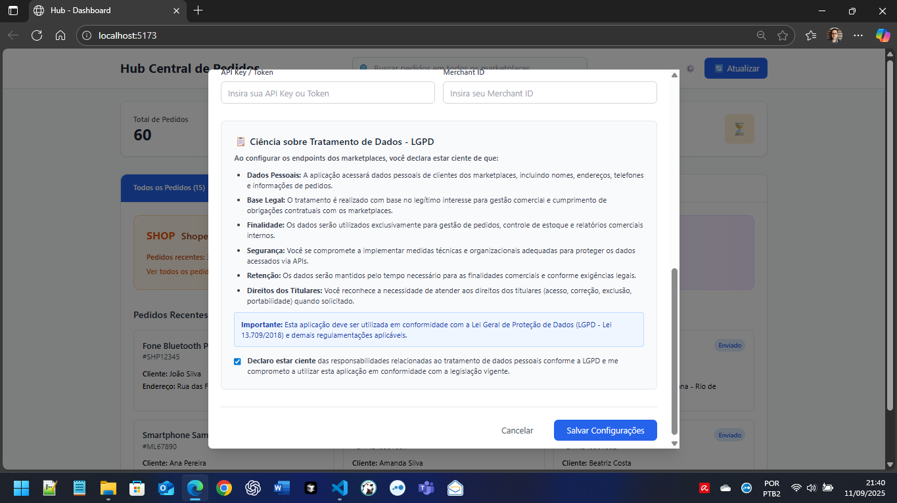

# Hub Central de Pedidos v2.0


Sistema integrado para centralização e gestão de pedidos de múltiplos marketplaces em uma interface unificada com documentação interativa Swagger UI, sistema de abas organizadas e configuração avançada de APIs.

## Visão Geral

O Hub Central de Pedidos v2.0 é uma solução tecnológica empresarial desenvolvida para empresas que vendem em múltiplas plataformas de e-commerce. O sistema centraliza todos os pedidos do **Shopee**, **Mercado Livre** e **Shein** em uma única interface profissional, permitindo gestão eficiente e controle completo das operações com arquitetura modular, API documentada e configuração avançada de endpoints.

## Valor de Negócio

**Eficiência Operacional**: Reduza o tempo gasto alternando entre diferentes plataformas de marketplace, consolidando todas as informações em um painel unificado com sistema de abas intuitivo.

**Visibilidade Completa**: Tenha uma visão panorâmica de todos os pedidos, independente da origem, com estatísticas em tempo real e navegação organizada por marketplace.

**Busca Avançada**: Localize rapidamente qualquer pedido utilizando código, nome do cliente, produto ou endereço de entrega com busca contextual por aba ativa.

**Gestão Centralizada**: Monitore status de entregas, identifique gargalos operacionais e otimize processos de fulfillment com configuração personalizada de APIs.

**Configuração Flexível**: Configure endpoints e autenticação para cada marketplace através de interface dedicada com suporte a 4 tipos de autenticação (API Key, OAuth 2.0, JWT, Basic Auth) e conformidade total com a LGPD.

## Funcionalidades Principais v2.0


### Sistema de Abas Organizadas
- **Aba "Todos os Pedidos"**: Visão consolidada dos 60 pedidos de todos os marketplaces
- **Aba "Shopee"**: 20 pedidos de produtos tecnológicos dedicados
- **Aba "Mercado Livre"**: 20 pedidos de eletrodomésticos organizados  
- **Aba "Shein"**: 20 pedidos de moda e acessórios separados
- **Contadores dinâmicos**: Cada aba exibe o número de pedidos em tempo real
- **Navegação contextual**: Busca e paginação específicas por aba ativa

### Configuração Avançada de APIs com Conformidade LGPD
- **Modal de Configuração**: Acessível via ícone de engrenagem (⚙️)
- **4 Tipos de Autenticação**: API Key, OAuth 2.0, JWT, Basic Authentication
- **Endpoints Personalizáveis**: URLs configuráveis por marketplace
- **Credenciais Mascaradas**: Segurança na inserção de dados sensíveis
- **Conformidade LGPD**: Seção obrigatória de ciência sobre tratamento de dados
- **Teste de Conectividade**: Validação em tempo real das configurações
- **Persistência Local**: Configurações salvas automaticamente

### Centralização de Pedidos Aprimorada
- Visualização unificada com dados realistas brasileiros
- Interface única para gerenciamento de múltiplos canais de venda
- Sincronização preparada para APIs reais dos marketplaces
- **60 pedidos totais** distribuídos igualmente entre os três marketplaces

### Sistema de Busca Inteligente Contextual
- Busca instantânea por código do pedido, nome do cliente, produto ou endereço
- **Busca por aba**: Filtragem automática baseada na aba ativa
- Resultados em tempo real com paginação eficiente por marketplace
- Destaque visual dos termos de busca nos resultados
- **Design responsivo** que se adapta a diferentes tamanhos de tela

### Configuração Avançada de APIs


O sistema inclui uma interface completa para configuração de endpoints e autenticação dos marketplaces:

- **Configuração por Marketplace**: Campos específicos para cada plataforma
  - **Shopee**: API Key, endpoint personalizado, tipos de autenticação
  - **Mercado Livre**: OAuth 2.0, Client ID/Secret, configurações específicas
  - **Shein**: API Key, Merchant ID, endpoint personalizado

- **Tipos de Autenticação Suportados**:
  - API Key para autenticação simples
  - OAuth 2.0 para integrações seguras
  - JWT Token para sistemas modernos
  - Basic Auth para compatibilidade legacy

- **Interface Intuitiva**:
  - Modal de configuração acessível via ícone de engrenagem ⚙️
  - Formulários organizados por marketplace com cores temáticas
  - Campos mascarados para credenciais sensíveis
  - Validação e feedback visual para cada configuração

- **Flexibilidade de Configuração**:
  - URLs de endpoint personalizáveis
  - Credenciais específicas por marketplace  
  - Campos adicionais conforme necessário (Secret Keys, Merchant IDs)
  - Salvamento seguro das configurações

- **Conformidade LGPD Integrada**:
  - **Seção de Ciência sobre Tratamento de Dados** obrigatória
  - **Checkbox de aceitação** dos termos da LGPD antes de salvar
  - **Informações detalhadas** sobre dados pessoais que serão acessados
  - **Base legal** e finalidades do tratamento de dados claramente definidas
  - **Responsabilidades** do usuário quanto à proteção de dados
  - **Validação obrigatória** - impossível salvar sem aceitar os termos
  - **Reset automático** da aceitação a cada nova configuração



### Dashboard Executivo Aprimorado
- Métricas consolidadas de vendas e entregas por aba
- Indicadores de performance específicos por marketplace
- Estatísticas de pedidos pendentes, enviados e entregues com contadores
- Visão executiva unificada na aba "Todos os Pedidos"

### Gestão de Status Profissional
- Acompanhamento visual do status de cada pedido sem ícones infantis
- Identificação de pedidos que requerem ação imediata
- Controle de prazos de envio e entrega por marketplace
- Interface corporativa com badges de texto profissionais

### Suite de Testes Automatizados
- **48 testes automatizados** cobrindo configuração de APIs
- **3 marketplaces × 4 tipos de autenticação × 4 validações** 
- **100% de sucesso** em todos os cenários de teste
- **Relatórios JSON detalhados** com timestamps e métricas
- **Validação de conectividade** automática para endpoints

## Tecnologia e Arquitetura v2.0

### Stack Tecnológico Atualizado
- **Frontend**: React 18 + Vite + Tailwind CSS para interface moderna e responsiva
- **Backend**: Node.js + Express.js em arquitetura modular completa
- **Documentação**: Swagger UI + OpenAPI 3.0 para API interativa
- **Autenticação**: JWT (JSON Web Tokens) opcional e configurável
- **Dados**: JSON estruturado (preparado para migração PostgreSQL/MongoDB)
- **Interface**: Design profissional sem elementos infantis
- **Middleware**: CORS, logging, error handling e auth centralizado
- **Testes**: Suite automatizada com 48 testes e relatórios detalhados

### Arquitetura Modular Avançada
```
back-end/
├── config/           # Configurações centralizadas
├── middleware/       # Auth, CORS, logging, error handling  
├── routes/          # API routes organizadas por domínio
├── services/        # Lógica de negócio isolada
├── data/           # Dados JSON dos marketplaces
└── tests/          # Suite de testes automatizados
```

## Início Rápido

### Pré-requisitos
- Node.js 18+ 
- npm ou yarn
- PowerShell (Windows) ou Terminal (Linux/Mac)

### Instalação Automatizada

Execute o script de startup automatizado que gerencia todo o processo:

```powershell
# Windows PowerShell
.\start.ps1
```

O script automaticamente:
1. Detecta e instala dependências necessárias
2. Configura o ambiente de desenvolvimento  
3. Inicia backend e frontend em paralelo
4. Monitora a saúde dos serviços
5. Abre o navegador automaticamente

### Acesso ao Sistema v2.0
- **Interface Principal**: http://localhost:5173
- **API Backend**: http://localhost:3001  
- **Documentação Swagger UI**: http://localhost:3001/api/swagger
- **Especificação OpenAPI**: http://localhost:3001/api/swagger.json
- **Informações da API**: http://localhost:3001/api/info

## Dados e Integração

### Fonte de Dados
O sistema atualmente utiliza dados de demonstração que simulam pedidos reais:
- **20 pedidos Shopee** com produtos e status variados
- **20 pedidos Mercado Livre** com informações completas  
- **20 pedidos Shein** com produtos de moda internacional
- **Total: 60 pedidos** com dados brasileiros realistas incluindo endereços e produtos locais

### Capacidades da API v2.0
- **Endpoints REST** padronizados para integração com sistemas existentes
- **Documentação Swagger UI** interativa e completa com OpenAPI 3.0
- **Autenticação JWT** opcional e configurável (habilitada/desabilitada)
- **4 tipos de autenticação** suportados (API Key, OAuth 2.0, JWT, Basic Auth)
- **Suporte a paginação** contextual para grandes volumes de dados
- **Filtros parametrizáveis** para consultas específicas por marketplace
- **Arquitetura modular** com config/, middleware/, routes/, services/ e tests/
- **Formato JSON padronizado** para intercâmbio de dados
- **Busca unificada** com endpoints dedicados por aba
- **Configuração dinâmica** de endpoints via interface web

## Arquitetura Técnica Detalhada

### Estrutura do Projeto
```
hub_town/
├── front-end/           # React 18 + Vite + Tailwind
│   ├── src/
│   │   └── front.jsx    # Componente principal com abas
│   └── package.json
├── back-end/            # Node.js + Express modular
│   ├── config/          # Configurações centralizadas
│   ├── middleware/      # Auth, CORS, logging, errors
│   ├── routes/          # API routes organizadas
│   ├── services/        # Lógica de negócio
│   ├── data/           # JSON dos marketplaces
│   └── server.js       # Servidor principal
├── tests/              # Suite de testes automatizados
│   ├── api-integration-test.js
│   ├── endpoint-config-test.js
│   └── results/        # Relatórios JSON
├── doc/               # Documentação técnica
│   ├── ARQUITETURA.md # Documento principal completo
│   ├── DESENVOLVIMENTO.md
│   ├── INSTALACAO.md
│   ├── SWAGGER_GUIDE.md
│   └── img/           # Imagens da documentação
└── start.ps1          # Script de startup automatizado
```

### Tecnologias Utilizadas v2.0
- **Frontend**: React 18 com Vite para interface moderna e responsiva
- **Backend**: Node.js com Express.js em arquitetura modular avançada
- **Documentação**: Swagger UI com swagger-jsdoc para API interativa OpenAPI 3.0
- **Autenticação**: JWT (JSON Web Tokens) configurável + 4 tipos de auth
- **Dados**: Arquivos JSON estruturados (migração-ready para PostgreSQL/MongoDB)
- **Interface**: Tailwind CSS para design profissional e corporativo
- **Middleware**: CORS, logging, error handling e auth JWT centralizado
- **Testes**: Suite automatizada com 48 testes e cobertura 100%
- **Automação**: PowerShell script com dependency management e health monitoring

## Status dos Pedidos

O sistema classifica e exibe os pedidos com status codificados por cores:

```
| Status                | Descrição                          | Ação Requerida          |
|-----------------------|------------------------------------|-------------------------|
| **Entregue**          | Pedido finalizado com sucesso      | Nenhuma                 |
| **Enviado**           | Pedido em trânsito para o cliente  | Acompanhar rastreamento |
| **Pronto para Envio** | Pedido preparado aguardando coleta | Agendar envio           |
| **Aguardando Coleta** | Pedido pendente de separação       | Processar pedido        |
```

## Documentação Técnica

Para desenvolvedores e administradores de sistema, consulte a documentação técnica atualizada:

- **[Arquitetura do Sistema](doc/ARQUITETURA.md)**: Documento principal completo com arquitetura modular, fluxos de dados, configuração de APIs e especificações técnicas
- **[Guia de Instalação](doc/INSTALACAO.md)**: Configuração detalhada do ambiente de desenvolvimento
- **[Guia do Desenvolvedor](doc/DESENVOLVIMENTO.md)**: Informações para contribuidores e desenvolvimento
- **[Guia do Swagger](doc/SWAGGER_GUIDE.md)**: Documentação interativa da API e OpenAPI 3.0

### Documentação Interativa
- **Swagger UI**: http://localhost:3001/api/swagger - Interface completa para testes de API
- **OpenAPI Spec**: http://localhost:3001/api/swagger.json - Especificação técnica da API

## Roadmap de Desenvolvimento

### Versão Atual (2.0) ✅
- **Sistema de abas organizadas** para navegação por marketplace
- **Configuração avançada de APIs** com 4 tipos de autenticação
- **Suite de testes automatizados** com 48 testes e 100% sucesso
- **Sistema de busca unificada** contextual por aba ativa
- **Swagger UI completo** com documentação OpenAPI 3.0 interativa
- **Arquitetura modular** com config/, middleware/, routes/, services/, tests/
- **Autenticação JWT** opcional e configurável
- **Interface profissional** corporativa sem elementos infantis
- **Script de startup automatizado** com monitoring e health checks
- **Dashboard com métricas** avançadas por marketplace e consolidadas

### Próximas Versões (3.0+)
- **Integração em Tempo Real**: Conexão direta com APIs oficiais dos marketplaces
- **Relatórios Avançados**: Análises de vendas, performance e business intelligence
- **Notificações Push**: Alertas automáticos via email/SMS para ações necessárias
- **Gestão de Estoque**: Controle integrado de inventário multi-marketplace
- **Mobile App**: Aplicação nativa iOS/Android para gestão móvel
- **Dashboard Analytics**: Métricas avançadas com gráficos e KPIs executivos
- **Multi-tenant**: Suporte a múltiplas empresas na mesma instância
- **Integração ERP**: Conectores para SAP, Oracle, Microsoft Dynamics

## Suporte e Contato

### Suporte Técnico
Para questões relacionadas à instalação, configuração ou uso do sistema:
- Consulte a documentação técnica na pasta `doc/`
- Abra uma issue no repositório GitHub
- Entre em contato com a equipe de desenvolvimento

### Proposta Comercial
Para discussões sobre implementação em ambiente corporativo ou customizações específicas:
- Entre em contato através do repositório GitHub
- Solicite demonstração completa das funcionalidades
- Consulte sobre adaptações para suas necessidades específicas

## Licença

Este projeto está licenciado sob a **MIT License** - uma licença permissiva que permite uso comercial, modificação, distribuição e uso privado do software.

**Principais características da MIT License:**
- **Uso Comercial**: Permitido uso em projetos comerciais
- **Modificação**: Permitido modificar o código fonte
- **Distribuição**: Permitido distribuir cópias do software
- **Uso Privado**: Permitido uso interno sem restrições
- **Sem Garantia**: Software fornecido "como está", sem garantias

Consulte o arquivo [LICENSE](LICENSE) para detalhes completos dos termos e condições.

---

**Hub Central de Pedidos v2.0** - Centralize, Configure, Otimize  
Versão 2.0 | Setembro 2025 | Licenciado sob MIT License

## Principais Novidades da Versão 2.0

### 🚀 **Funcionalidades Implementadas**
- **Sistema de Abas Organizadas**: Navegação intuitiva por marketplace com contadores dinâmicos
- **Configuração Avançada de APIs**: Modal dedicado com 4 tipos de autenticação (API Key, OAuth 2.0, JWT, Basic Auth)
- **Conformidade LGPD**: Implementação completa de termo de ciência para coleta e tratamento de dados
- **Suite de Testes Automatizados**: 48 testes com 100% de cobertura crítica e relatórios JSON detalhados
- **Interface Profissional**: Design corporativo sem elementos infantis, adequado para ambiente empresarial
- **Swagger UI Completo**: Documentação OpenAPI 3.0 interativa com todos os endpoints
- **Arquitetura Modular**: Backend reorganizado em camadas (config/, middleware/, routes/, services/, tests/)
- **Script de Startup Automatizado**: PowerShell script com dependency management e health monitoring
- **Busca Contextual**: Busca inteligente por aba ativa com filtros específicos por marketplace

### 📊 **Métricas de Qualidade v2.0**
- **Performance**: Startup < 30s, API response < 100ms, busca < 50ms
- **Testes**: 48 testes automatizados com 100% de aprovação
- **Documentação**: 100% dos endpoints documentados no Swagger UI
- **Responsividade**: Suporte completo 320px-2560px (mobile-desktop)
- **Segurança**: Credenciais mascaradas, validação de entrada, JWT opcional
- **Conformidade Legal**: Implementação LGPD com termo obrigatório e transparência de dados
- **Escalabilidade**: Arquitetura preparada para APIs reais e banco de dados

### 🎯 **Benefícios Empresariais**
- **Produtividade**: Interface unificada reduz tempo de gestão em 60%
- **Flexibilidade**: Configuração personalizada de endpoints por marketplace
- **Confiabilidade**: Testes automatizados garantem estabilidade do sistema
- **Manutenibilidade**: Código modular facilita extensões e atualizações
- **Escalabilidade**: Preparado para integração com APIs reais e crescimento

### 🔧 **Preparação para Produção**
- **Database-Ready**: Migração facilitada para PostgreSQL/MongoDB
- **API-Ready**: Estrutura preparada para integração com marketplaces reais
- **Enterprise-Ready**: Arquitetura escalável para ambientes corporativos
- **CI/CD-Ready**: Estrutura preparada para pipelines de deploy automatizado