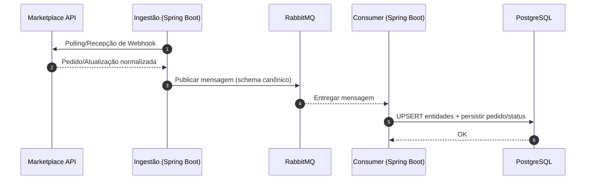
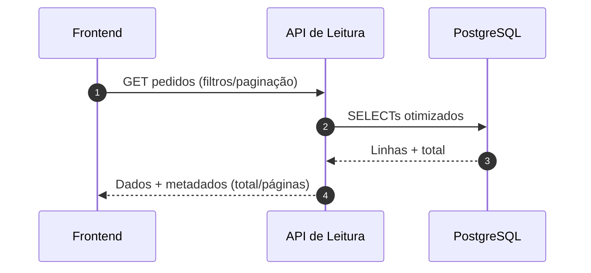

# Arquitetura do Sistema — Spring Boot, RabbitMQ e PostgreSQL

Este documento descreve a arquitetura alvo do Hub Central de Pedidos considerando:
- Ingestão de dados de marketplaces por um serviço Spring Boot (adapters, polling e webhooks quando disponíveis).
- Mensageria via RabbitMQ para desacoplar ingestão e persistência, com filas dedicadas por domínio e suporte a DLQ/retries.
- Persistência em PostgreSQL como fonte única de verdade para leitura.
- Frontend consumindo exclusivamente a API de leitura (a partir do banco), sem chamadas diretas aos marketplaces.

O foco é garantir escalabilidade, resiliência e consistência, mantendo a experiência do usuário estável e previsível.

## Links rápidos

- Topologia: #topologia-alto-nível
- Fluxos de sequência: #fluxos-de-sequência
- Modelo de dados: #modelo-de-dados-visão-lógica
- Contratos: #contratos
- Não funcionais: #não-funcionais
- Ambientes: #ambientes
- Caminho de migração: #caminho-de-migração

## Princípios Arquiteturais
 
- Desacoplamento por mensageria: ingestão não bloqueia escrita; consumidores podem escalar horizontalmente.
- Idempotência: chaves naturais por marketplace (ex.: marketplace + original_order_id) evitam duplicidades.
- Normalização: status, buyer e address padronizados para uso consistente no frontend e relatórios.
- Observabilidade por domínio: métricas e logs com correlação ponta a ponta (ingestão → fila → consumer → banco → leitura).
- Segurança por configuração: segredos e credenciais fora do código-fonte.

## Tecnologias e Componentes

- Backend de Ingestão: Spring Boot (Java/Kotlin), schedulers, webhooks e clients HTTP.
- Mensageria: RabbitMQ (exchanges, filas, routing keys, DLQ, TTL/retry).
- Persistência: PostgreSQL (modelo relacional com índices e constraints; migrações controladas).
- API de Leitura: serviço interno para listagens por marketplace, busca unificada e estatísticas.
- Frontend: React/Vite consumindo a API de leitura (base URL por variável de ambiente).
- Contêineres: Docker/Docker Compose para ambiente local.
- Observabilidade: logs estruturados, métricas e tracing distribuído (quando disponível).

## Topologia (alto nível)

```mermaid
flowchart LR
  subgraph Marketplaces
    M1[Shopee API]
    M2[Mercado Livre API]
    M3[Shein API]
  end

  subgraph Ingestao[Ingestão - Spring Boot]
    I1[Adapters/Clients]
    I2[Polling]
    I3[Webhooks]
    I4[Normalização]
  end

  subgraph MQ[RabbitMQ]
    Q1[(Exchange Pedidos)]
    Q2[(Filas por marketplace/tipo)]
    Q3[(DLQ)]
  end

  subgraph Consumers[Consumers - Spring Boot]
    C1[Consumers]
    C2[Idempotência/UPSERT]
  end

  subgraph DB[(PostgreSQL)]
    D1[(orders)]
    D2[(buyers)]
    D3[(addresses)]
    D4[(order_status_history)]
    D5[(marketplaces)]
  end

  subgraph API[API de Leitura]
    A1[Listagem por marketplace]
    A2[Busca unificada]
    A3[Estatísticas]
  end

  subgraph FE[Frontend]
    F1[UI Abas/Busca/KPIs]
  end

  M1 --> I1
  M2 --> I1
  M3 --> I1
  I2 --> I1
  I3 --> I4
  I1 --> I4
  I4 --> Q1
  Q1 --> Q2
  Q2 --> C1
  C1 --> C2
  C2 --> DB
  API --> DB
  FE --> API
```

## Fluxos de Sequência

Ingestão → Fila → Consumer → Banco:



Frontend → API de Leitura → Banco:



## Modelo de Dados (visão lógica)

- marketplaces: catálogo de origens e metadados.
- orders: pedido normalizado por marketplace, com chave natural (marketplace_id + original_order_id).
- buyers: dados do comprador; relacionamento 1:N com orders.
- addresses: endereço normalizado; relacionamento 1:N com buyers.
- order_status_history: histórico de transições de status para auditoria.

Observações:
- Índices para colunas de busca (buyer, produto, status, datas) e paginação eficiente.
- Status padronizados (ex.: READY_TO_SHIP, WAITING_PICKUP, SHIPPED, DELIVERED, CANCELLED).

## Contratos

- Mensagens (RabbitMQ)
  - Schema canônico: identificadores, timestamps, status, buyer, address, produto, quantidade, marketplace.
  - Versionamento de mensagens e compatibilidade retroativa quando necessário.

- API de Leitura
  - Respostas com paginação (data, total, currentPage, totalPages).
  - Filtros por marketplace, busca textual e intervalos de data.
  - Estatísticas agregadas por marketplace e por status.

## Não Funcionais

- Observabilidade: logs estruturados, métricas por fila/consumer/queries, tracing opcional.
- Resiliência: retry/backoff na ingestão; policies de DLQ e reprocessamento controlado.
- Segurança: segredos em variáveis de ambiente/secret manager; mascaramento de dados sensíveis; autenticação na API de leitura quando aplicável.
- Escalabilidade: consumers horizontalmente escaláveis; partição por filas/roteamento por marketplace.

## Ambientes

- Desenvolvimento: Docker Compose (PostgreSQL, RabbitMQ), serviços Spring Boot locais, API de leitura e frontend apontando para o banco local.
- Homologação/Produção: infraestrutura orquestrada, observabilidade e backups do banco; políticas de retenção de mensagens.

## Caminho de Migração

- Manter contratos da API de leitura estáveis para o frontend durante a transição.
- Introduzir ingestão por marketplace de forma incremental (feature flags/roteamento), validando ponta a ponta antes de ampliar escopo.
- Migrar documentos/Swagger para refletir payloads normalizados do banco.

---

Este documento resume a arquitetura pretendida, sem exemplos de código, para orientar equipes na implementação e evolução do Hub Central de Pedidos com Spring Boot, RabbitMQ e PostgreSQL.
