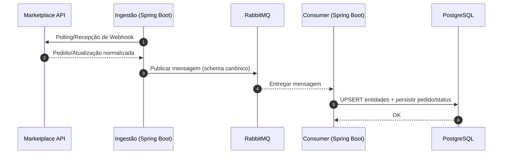
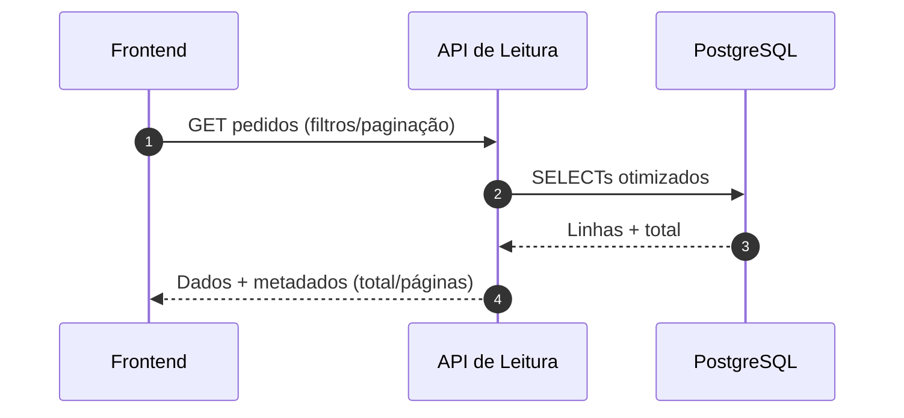

# Guia do Desenvolvedor - Hub Central de Pedidos v2.0

## Configuração do Ambiente de Desenvolvimento

### IDE Recomendada
- **Visual Studio Code** com extensões:
  - ES7+ React/Redux/React-Native snippets
  - Tailwind CSS IntelliSense
  - Prettier - Code formatter
  - ESLint
  - Thunder Client (para testar API)
  - **Swagger Viewer** (para visualizar docs OpenAPI)
  - **REST Client** (alternativa ao Thunder Client)

### Configuração do Git
```powershell
# Configurar informações do usuário
git config --global user.name "Seu Nome"
git config --global user.email "seu.email@exemplo.com"

# Configurar line endings (Windows)
git config --global core.autocrlf true
```

## Nova Estrutura Modular v2.0

### Backend Modular (Node.js + Express)

#### Arquivo Principal: `server.js`
```javascript
// Nova estrutura modular
import express from "express";
import cors from 'cors';
import swaggerUi from 'swagger-ui-express';
import config from './config/config.js';
import { swaggerSpec } from './config/swagger.js';

// Importar rotas modulares
import authRoutes from './routes/auth.js';
import marketplaceRoutes from './routes/marketplace.js';
import ordersRoutes from './routes/orders.js';

const app = express();
const PORT = config.server.port;

// Middleware stack v2.0
app.use(cors(config.server.cors));
app.use(express.json());
app.use(logging_middleware);

// Swagger UI
app.use('/api/swagger', swaggerUi.serve, swaggerUi.setup(swaggerSpec));

// Modular routes
app.use('/api/auth', authRoutes);
app.use('/api/marketplace', marketplaceRoutes);
app.use('/api/orders', ordersRoutes);
```

#### Configuração Centralizada: `config/config.js`
# Guia do Desenvolvedor — Arquitetura com Spring Boot, RabbitMQ e PostgreSQL

Este guia descreve como desenvolver no Hub Central de Pedidos assumindo a arquitetura em que:
- As integrações com marketplaces são consumidas por um serviço de backend em Spring Boot.
- Os eventos e dados de pedidos trafegam por uma fila mensageria (RabbitMQ) para desacoplar ingestão e persistência.
- A persistência é feita no banco de dados PostgreSQL, que torna-se a fonte única de verdade para leitura.
- O frontend consome somente os dados consolidados do banco via API interna de leitura (sem chamadas diretas aos marketplaces).

O objetivo é garantir robustez, escalabilidade e consistência, permitindo que o frontend opere sobre dados normalizados e estáveis, enquanto a ingestão lida com variações e picos das APIs externas.

## Tecnologias e Ferramentas

- Backend de Ingestão: Spring Boot (Java/Kotlin), clients HTTP, schedulers, validação.
- Mensageria: RabbitMQ (exchanges, filas, routing keys, DLQ, TTL/retry).
- Persistência: PostgreSQL (modelo relacional, índices, constraints, migrações).
- API de Leitura: Serviço interno para consultas paginadas, busca unificada e estatísticas.
- Frontend: React + Vite (UI), consumo de API via base URL configurável.
- Contêineres e Orquestração: Docker/Docker Compose para ambientes locais.
- Observabilidade: logs estruturados, métricas, dashboards e tracing distribuído (quando disponível).
- Autenticação/Autorização: mecanismo a definir para a API de leitura (ex.: JWT, OAuth2 Resource Server).

## Visão Geral da Arquitetura

- Ingestão (Spring Boot): componentes responsáveis por autenticação, agendamento de polling e/ou recepção de webhooks dos marketplaces, normalização de payloads e publicação de mensagens na fila.
- Mensageria (RabbitMQ): exchanges, filas, roteamento por marketplace/tipo de evento e dead-letter para reprocessamento seguro.
- Persistência (Spring Boot Consumers): consumidores que processam mensagens da fila, aplicam validações/transformações e gravam entidades no PostgreSQL.
- Banco de Dados (PostgreSQL): modelo relacional com entidades de pedidos, compradores, endereços, histórico de status e metadados de marketplaces.
- API de Leitura: camada de serviço para consulta paginada, busca unificada e estatísticas, sempre a partir do banco.
- Frontend (React/Vite): UI que consome a API de leitura para listar, pesquisar e visualizar métricas; nunca acessa marketplaces diretamente.

### Diagrama de Topologia (alto nível)

```mermaid
flowchart LR
  subgraph Marketplaces
    M1[Shopee API]
    M2[Mercado Livre API]
    M3[Shein API]
  end

  subgraph Ingestao[Ingestão - Spring Boot]
    I1[Adapters/Clients]
    I2[Polling Schedulers]
    I3[Webhooks (quando suportado)]
    I4[Normalização]
  end

  subgraph MQ[RabbitMQ]
    Q1[(Exchange Pedidos)]
    Q2[(Filas por marketplace/tipo)]
    Q3[(DLQ)]
  end

  subgraph Persistencia[Consumers - Spring Boot]
    C1[Consumers]
    C2[Idempotência/UPSERT]
  end

  subgraph DB[(PostgreSQL)]
    D1[(orders)]
    D2[(buyers)]
    D3[(addresses)]
    D4[(order_status_history)]
    D5[(marketplaces)]
  end

  subgraph API[API de Leitura]
    A1[Listagem por Marketplace]
    A2[Busca Unificada]
    A3[Estatísticas]
  end

  subgraph FE[Frontend]
    F1[UI Abas/Busca/KPIs]
  end

  M1 --> I1
  M2 --> I1
  M3 --> I1
  I2 --> I1
  I3 --> I4
  I1 --> I4
  I4 --> Q1
  Q1 --> Q2
  Q2 --> C1
  C1 --> C2
  C2 --> DB
  API --> DB
  FE --> API
```

### Diagramas de Sequência

Ingestão → Fila → Consumer → Banco:



Frontend → API de Leitura → Banco:



## Fluxos Principais

1) Ingestão
- Autenticação com cada marketplace conforme especificação (OAuth, API Key, etc.).
- Pull (polling) e/ou Push (webhooks) de pedidos e atualizações.
- Normalização de atributos (status, IDs de pedidos, campos de endereço, comprador, produto).
- Publicação de mensagens no RabbitMQ com schema padronizado.

2) Persistência
- Consumers Spring Boot leem as mensagens e aplicam idempotência (evitar duplicidade por chave natural por marketplace).
- UPSERT de entidades relacionadas (comprador, endereço) e inserção/atualização de pedidos e histórico de status.
- Tratamento de erros com DLQ e métricas de reprocessamento.

3) Consulta
- API de leitura realiza queries no PostgreSQL para fornecer:
  - Listagem por marketplace com paginação e filtros de busca.
  - Busca unificada de pedidos de todos os marketplaces.
  - Estatísticas agregadas (por marketplace, por status, totais).
- Frontend consome essas rotas, exibindo contadores, abas por marketplace e visão "Todos" unificada.

## Componentes e Responsabilidades

- Spring Boot — Ingestão
  - Clientes/Adapters por marketplace (credenciais, endpoints, backoff, retry).
  - Agenda de polling e controladores de webhooks (quando suportado).
  - Normalização de dados e publicação em RabbitMQ.

- RabbitMQ
  - Exchanges por domínio (por exemplo, pedidos) e roteamento por marketplace/tipo.
  - Filas de processamento e Dead-Letter Queues.
  - Políticas de TTL, retry e visibilidade de métricas.

- Spring Boot — Consumers
  - Leitura das filas, validações e orquestração de persistência.
  - Idempotência por chave composta (marketplace + original_order_id).
  - Registro de histórico de status e consistência referencial.

- PostgreSQL
  - Tabelas de marketplaces, orders, buyers, addresses, order_status_history.
  - Índices para busca (por buyer, produto, status, datas) e paginação eficiente.
  - Restrições de integridade e chaves naturais onde aplicável.

- API de Leitura
  - Rotas para listagem por marketplace, busca unificada e estatísticas.
  - Paginação padrão (limit/page) e metadados (total, currentPage, totalPages).
  - Respostas normalizadas (status em formato padronizado; identificadores consistentes).

- Frontend
  - Consome exclusivamente a API interna de leitura.
  - Abas por marketplace e visão unificada, com contadores e KPIs derivados da API de estatísticas.
  - Base de URL configurável por variável de ambiente, sem URLs fixas no código.

## Convenções e Padrões

- Contratos de Mensagens
  - Definir um schema canônico para eventos de pedidos (ex.: campos obrigatórios, status normalizados, timestamps).
  - Versionamento de mensagens para evoluções sem quebra.

- Contratos de API (Leitura)
  - Campos de paginação e contagem padronizados.
  - Filtros de busca consistentes (buyer, produto, status, datas).
  - Documentação OpenAPI e exemplos alinhados ao payload persistido.

- Observabilidade
  - Log estruturado com correlação (trace/Span IDs entre ingestão, fila e persistência).
  - Métricas por marketplace (taxa de eventos, erros, latências, retries).
  - Dashboards para filas (backlog, DLQ) e banco (taxas de leitura/escrita, locks).

- Resiliência e Qualidade
  - Retry exponencial na ingestão e nos consumers conforme categoria de erro.
  - Circuit breakers para integrações externas.
  - Idempotência e consistência eventual claramente documentadas.

- Segurança
  - Gestão de segredos via variáveis de ambiente/secret manager.
  - Sanitização de logs e mascaramento de dados sensíveis.
  - Autenticação/autorização da API de leitura (quando habilitada).

## Ambientes e Configuração

- Dependências de Infraestrutura
  - PostgreSQL acessível na rede local de desenvolvimento.
  - RabbitMQ em contêiner local para filas e DLQs, com painel de administração.
  - Serviço Spring Boot para ingestão e consumo.

- Variáveis de Ambiente (exemplos de categorias)
  - Banco de dados: host, porta, nome, usuário, senha, pool.
  - RabbitMQ: URL, exchanges, filas e chaves de roteamento.
  - Marketplaces: base URLs, credenciais, escopos, callbacks.
  - API de leitura: porta, CORS, logging, flags de recursos.

- Dados de Referência
  - Marketplaces pré-cadastrados na tabela de referência.
  - Seeds para ambientes de desenvolvimento, quando aplicável.

## Fluxo de Desenvolvimento

- Planejar a evolução de contratos (mensagens e respostas) antes de alterar consumidores e frontend.
- Implementar/adaptar adapters por marketplace e validar o ciclo completo até o DB via fila.
- Verificar paginação, busca e estatísticas na API de leitura contra dados do banco.
- Garantir que o frontend consome apenas a API de leitura, com variáveis de ambiente para base URL.

## Testes e Qualidade

- Testes de Unidade
  - Normalização de payloads e mapeamentos por marketplace.
  - Regras de idempotência e validações de domínio.

- Testes de Integração
  - Publicação/consumo de mensagens (RabbitMQ) ponta a ponta.
  - Persistência no PostgreSQL e leitura via API.

- Testes de Contrato
  - Schemas das mensagens e das respostas HTTP documentados e validados automaticamente.

- Testes do Frontend
  - Estados de carregamento/erro e paginação unificada.
  - KPIs alimentados pela API de estatísticas.

## Observabilidade e Troubleshooting

- Rastreabilidade ponta a ponta (ingestão → fila → consumer → DB → leitura).
- Alarmes para DLQ, backlog elevado, falhas de autenticação e picos de latência.
- Playbooks de reprocessamento e limpeza de mensagens problemáticas.

## Deploy e Operação

- Pipelines
  - Build/test para serviços Spring Boot e API de leitura.
  - Verificações de migração de banco e compatibilidade de contratos.

- Estratégia de Rollout
  - Habilitação gradual por marketplace/rota.
  - Feature flags para alternar ingestão/persistência por origem.

- Backup e Retenção
  - Políticas de backup do PostgreSQL e retenção de mensagens históricas conforme necessidades de auditoria.

## Notas de Transição

- Enquanto os serviços Spring Boot são desenvolvidos, a API de leitura existente pode continuar operando desde que mantenha os contratos de resposta documentados.
- O frontend não requer alterações estruturais desde que a API de leitura preserve os campos de paginação, busca e estatísticas acordados.

---

Este documento se concentra em diretrizes e processos, sem exemplos de código, para orientar o desenvolvimento consistente na arquitetura baseada em Spring Boot, RabbitMQ e PostgreSQL.
  } catch (error) {
