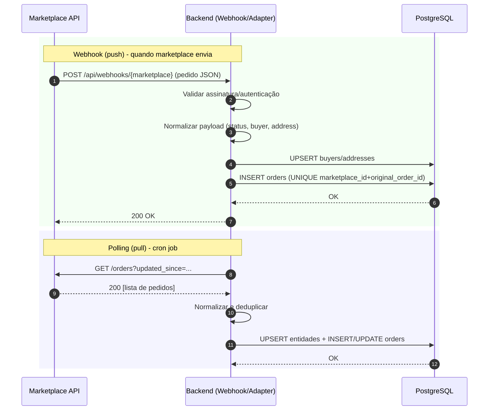
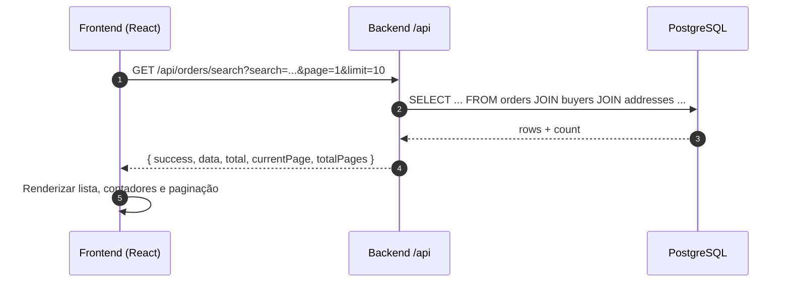

# Plano de Ação 01 — Endpoints com Dados Reais (PostgreSQL) e Frontend consumindo DB

Objetivo: substituir o consumo de mocks por dados reais do PostgreSQL nos endpoints da API e ajustar o frontend para consultar esses dados reais com paginação e busca unificada.


## Resultado esperado
- API servindo pedidos a partir do PostgreSQL: paginação, busca e estatísticas via SQL.
- Frontend consumindo os endpoints reais e exibindo contadores corretos, “Todos os pedidos” via busca unificada e paginação funcional.
- Possibilidade de fallback rápido para MOCK via configuração (feature flag).


## Escopo técnico (alto nível)
- Backend
  - Alternância de fonte de dados: mock | db | api (env/config).
  - Endpoints lendo do Postgres: `/marketplace/:marketplace/orders`, `/orders/search`, `/orders/stats`.
  - Swagger atualizado para refletir a origem de dados e respostas reais.
- Frontend
  - Ler baseURL da API via variável de ambiente (Vite) e não hard-coded.
  - Usar campos `total`, `currentPage`, `totalPages` retornados pela API para contadores e paginação.
  - Abas específicas consultam `/marketplace/:marketplace/orders` do DB; aba “Todos” consulta `/orders/search` (unificada, DB).
- Operacional
  - Corrigir pequenos erros no `start.ps1` e garantir subida consistente do Postgres + migração.
  - Manter rollback simples para mock se necessário (troca de config).


## Fase 0 — Preparação e Saúde do Ambiente
- [ ] Corrigir mensagens truncadas no `start.ps1` (linhas com Write-Host quebradas)
- [ ] Validar `docker-compose up -d` para Postgres (container `hubtown_postgres` OK)
- [ ] Executar `database/init-db.ps1` via `setup-database.ps1` e confirmar `schema.sql` + `seeds.sql`
- [ ] Rodar `back-end/migrate-json-data.js` e validar contagens nas tabelas
- [ ] Adicionar `back-end/.env.example` (PORT, DB_HOST, DB_PORT, DB_NAME, DB_USER, DB_PASSWORD, AUTH_ENABLED, JWT_SECRET)
- [ ] Ajustar `/api/info` para refletir a origem de dados atual (mock/db/api)

Critérios de aceitação
- Postgres ativo em localhost:5432 com DB `hubtown_db`
- Tabelas criadas e populadas; `orders` contém registros inseridos a partir dos JSONs
- `GET /api/info` mostra `features.realAPI` coerente com a fonte de dados


## Fase 1 — Backend lendo do DB (Leitura)
1) Alternância de fonte de dados
- [ ] Adicionar `config.data = { source: process.env.DATA_SOURCE || 'mock' }`
- [ ] Introduzir checagem desta flag nos services (prioridade: leitura via DB)

2) Endpoints Marketplace (DB)
- [ ] Implementar caminho DB no `marketplaceService.getOrders()` utilizando queries SQL:
  - Filtrar por marketplace (via nome mapeado na tabela `marketplaces`)
  - Aplicar busca por `orderId`, `buyer`, `product`, `address` (via joins com buyers/addresses)
  - Paginação via `LIMIT/OFFSET`
- [ ] Manter fallback para MOCK caso `DATA_SOURCE=mock`

3) Busca Unificada (DB)
- [ ] Implementar `orders.getAllOrders` com SQL unificado em todas as origens (todas as linhas de `orders`)
- [ ] Suporte a `search`, `page`, `limit` e ordenação por `created_at` (ou `hub_order_id`)

4) Estatísticas (DB)
- [ ] Reescrever `/orders/stats` para computar via SQL (COUNT por marketplace, COUNT por status, últimos n pedidos)

5) Swagger
- [ ] Ajustar descrição e exemplos conforme payload real do DB
- [ ] Corrigir `docExpansion` para valor suportado (`list`)

Critérios de aceitação
- `GET /api/marketplace/shopee/orders?limit=5&page=1&search=...` retorna dados do DB com total/paginação corretos
- `GET /api/orders/search?limit=10` lista unificada do DB
- `GET /api/orders/stats` consolidado a partir do DB
- Alterar `DATA_SOURCE=mock|db` alterna entre modos sem mudar código


## Fase 2 — Persistência (Escrita) e Configurações (Opcional nesta entrega)
Opcional nesta primeira entrega, mas recomendado como próximo passo.

- [ ] POST `/api/orders` — criar pedido (validações mínimas; grava em `orders` com buyer/address normalizados)
- [ ] PATCH `/api/orders/:id/status` — atualizar status (gravar em `order_status_history`)
- [ ] Criar tabela `marketplace_configs` para persistir configurações de endpoints/credenciais
- [ ] GET/PUT `/api/marketplace/:marketplace/config` — salvar/ler configurações públicas (mascarar segredos)
- [ ] Endpoint “teste de conectividade” que realize uma chamada real (com timeout) quando `baseUrl` configurado

Critérios de aceitação (parciais)
- Criar/atualizar pedidos funciona e reflete no DB e na API de leitura
- Configurações salvas no DB, com campos sensíveis mascarados na resposta


## Fase 3 — Frontend consumindo DB
- [ ] Introduzir `VITE_API_BASE_URL` (env) no frontend
- [ ] Substituir URLs fixas (`http://localhost:3001`) por `import.meta.env.VITE_API_BASE_URL`
- [ ] Abas Shopee/ML/Shein passam a chamar endpoints DB (`/api/marketplace/:id/orders`)
- [ ] Corrigir contadores para usar `total` da resposta (não o length da página)
- [ ] Aba “Todos” consome `/api/orders/search` (unificada) com paginação independente
- [ ] Mostrar estado de carregamento e erros conforme novas chamadas

Critérios de aceitação
- Ao mudar de página/aba, frontend reflete paginação real do DB
- Contadores exibem o total do marketplace (do DB)
- Busca unificada retorna itens de todos os marketplaces do DB


## Fase 4 — Testes e Saúde
- [ ] Adicionar testes mínimos de integração (Node) para `GET /api/marketplace/:id/orders`, `GET /api/orders/search`, `GET /api/orders/stats` (modo DB)
- [ ] Atualizar testes existentes para considerar `DATA_SOURCE=db`
- [ ] (Opcional) Configurar um runner de testes (Jest/Vitest) e script npm

Critérios de aceitação
- Testes passam localmente em modo DB
- Smoke test: abrir Swagger e validar manualmente os 3 endpoints principais


## Mapeamento de arquivos (provável impacto)
- Backend
  - `back-end/config/config.js` (nova chave data.source)
  - `back-end/config/swagger.js` (docExpansion e exemplos)
  - `back-end/config/database.js` (consultas auxiliares, se necessário)
  - `back-end/services/marketplaceService.js` (caminhos DB para leitura)
  - `back-end/routes/marketplace.js` e `back-end/routes/orders.js` (semântica de resposta, paginação)
  - `back-end/server.js` (`/api/info` refletir source)
- Frontend
  - `front-end/vite.config.js` e `.env` (VITE_API_BASE_URL)
  - `front-end/front.jsx` (chamadas, contadores, “Todos”, paginação)
- Scripts/Infra
  - `start.ps1` (mensagens truncadas e robustez)
  - `docker-compose.yml` (ok)
  - `back-end/.env.example` (novo)


## Riscos e mitigação
- Diferentes formatos de endereço nos JSONs podem impactar normalização → manter fallback robusto no parser (já existe) e logar avisos
- Duplicidade de `orderId` em mocks pode reduzir contagens no DB (UNIQUE) → ajustar JSONs ou aceitar dedupe; reportar no log de migração
- Mudança de contratos no FE (contadores/paginação) → alinhar tipos e testar manualmente


## Rollback
- Alterar `DATA_SOURCE=mock` no `.env` do backend para voltar a servir dados mock as-is
- Frontend continua funcional (dados de exemplo) sem mudanças estruturais


## Linha do tempo sugerida
- Dia 1: Fase 0 (preparação) + início Fase 1 (flag e `/marketplace/:id/orders` via DB)
- Dia 2: Fase 1 (search/stats via DB) + Swagger + smoke test
- Dia 3: Fase 3 (frontend baseURL, contadores e “Todos”) + testes mínimos (Fase 4)
- Dia 4+: Fase 2 (persistência escrita e configs) conforme prioridade


## Próximas ações (execução imediata)
- [ ] Criar `back-end/.env.example`
- [ ] Corrigir `start.ps1` mensagens truncadas
- [ ] Implementar `config.data.source` e caminhos DB para leitura em `marketplaceService`
- [ ] Ajustar frontend para `VITE_API_BASE_URL` e contadores por `total`

---

Responsável: Equipe Hub  •  Revisão: Produto/Tech Lead  •  Versão: 1.0 (2025-09-13)

## Esquemático da arquitetura alvo (sem mocks)

Abaixo um desenho esquemático da topologia final onde:
- Mocks são removidos do caminho de execução.
- O backend recebe dados reais via Webhooks (push) ou Polling (pull) das APIs oficiais e persiste no PostgreSQL.
- O frontend NUNCA consulta marketplaces diretamente e SEMPRE consome os dados via API do backend que lê do banco.

### Visão de componentes

```mermaid
flowchart LR
  subgraph Marketplaces [APIs Oficiais]
    A1[Shopee API]
    A2[Mercado Livre API]
    A3[Shein API]
  end

  subgraph Backend [Node/Express]
    B1[/Webhooks: /api/webhooks/:mp/]
    B2[Jobs de Polling/Adapters]
    B3[Serviços: MarketplaceService (DB)]
    B4[Rotas REST: /api/marketplace, /api/orders]
  end

  subgraph Database [PostgreSQL]
    D1[(marketplaces)]
    D2[(orders)]
    D3[(buyers)]
    D4[(addresses)]
    D5[(order_status_history)]
  end

  subgraph Frontend [React/Vite]
    F1[UI Abas + Busca + Stats]
  end

  A1 -->|Eventos/Webhooks| B1
  A2 -->|Eventos/Webhooks| B1
  A3 -->|Eventos/Webhooks| B1
  B2 -->|Polling/ETL| A1
  B2 -->|Polling/ETL| A2
  B2 -->|Polling/ETL| A3
  B1 -->|Normaliza/Valida| B3
  B2 -->|Normaliza/Valida| B3
  B3 -->|Upsert| D2
  B3 --> D3
  B3 --> D4
  B3 --> D5

  F1 -->|GET /api/marketplace/:id/orders| B4
  F1 -->|GET /api/orders/search| B4
  F1 -->|GET /api/orders/stats| B4
  B4 -->|SELECT/Paginação| B3
  B3 -->|SQL| D2
  D2 --> B3
  B3 --> B4
  B4 --> F1
```

### Sequência — Ingestão (push e pull)



### Sequência — Consulta (Frontend → API → DB)



### Regras de operação (sem mocks)
- Frontend não faz chamadas diretas aos marketplaces (apenas à API interna).
- `config.data.source = 'db'` e caminhos de mock desabilitados no runtime.
- Ingestão por Webhooks (preferencial) e/ou Jobs de Polling com normalização e UPSERT no DB.
- Campos sensíveis e endpoints externos configurados via `.env` e/ou tabela `marketplace_configs` (segredos mascarados nas respostas).

